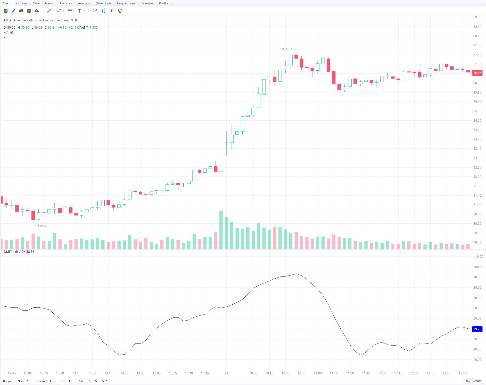
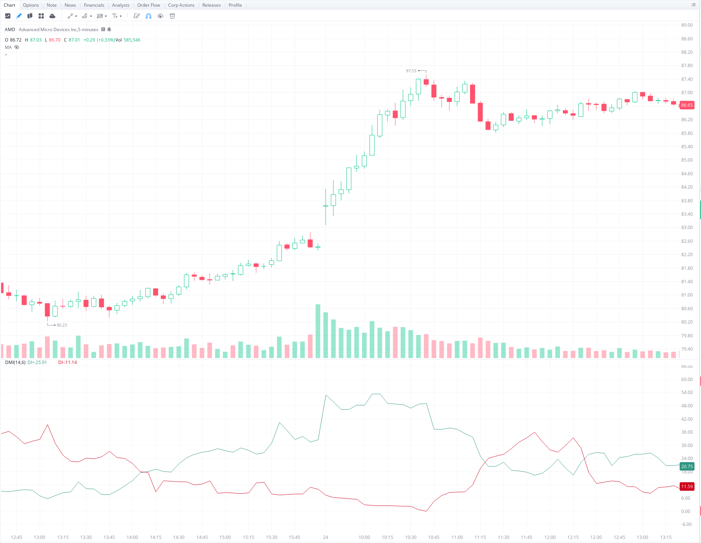

# **Algorithmic Trading Project**

## **Project Overview**

This project ultilizes a momentum-based strategy to autonomously day-trade on the stock market. 
- **Contents**
    - Trading Stategy
        - ADX
        - +DI and -DI
        - Entering Positions
        - Stop-Loss Margins
    - Code Overivew
        - Price
        - Technical Analysis
        - Signals
        - Streaming
        - Authentication
    - Current Goals
        - Storing Orders
        - Determining Take-Profit Margins
---

## **Trading Strategy**

This trading strategy incorporates the **ADX** and **DMI** to determine buy and sell signals for long and short positions. 

- **ADX**
  - The ADX, or "Average Directional Index", is a technical indicator that measures the strength of the current trend.
  - An ADX value above 25 signifies that the current trend is strong, while an ADX value below 25 means that the current trend is weak.
  - The main disadvantage with the ADX is that it does not tell you the direction of the trend.
  - Here is an example of the ADX with the 5-minute chart for AMD. We can see that as the price starts to increase at a faster rate, the ADX increases, and as soon as the rate of price reaches a level of resistance, the ADX starts to decrease.
  -  
  

- **DMI**
  - To get the direction of a current trend, one can use the **+DI** and **-DI**, which are the positive and negative directional indicators that are a part of the **DMI**.
  - When the +DI is above the -DI, it signifies that an uptrend is taking place.
  - When the -DI is above the +DI, it signifies that a downtrend is taking place.
  - Here is an example of the +DI and -DI with the 5-minute chart for AMD. We can see that when the +DI is above the -DI, the price is increasing. Additionally, when the -DI is above the +DI, the price decreases.
  -  
  

- **Entering Positions**
  - The **3** things to consider when entering a position are
    - **Trend Strength:** We want to make sure the ADX is above 25 when we enter positions.
    - **DI Crossover:** We want to check points were the +DI crosses over the -DI, or were the -DI crosses over the +DI. These crossovers are points were the trend may shift from uptrend to downtrend or vice versa.
      - For a **Long** position, we want to see when the +DI crosses over the -DI.
      - For a **Short** position, we want to see when the -DI crosses over the +DI.
    - **Increasing Trend Strength:** We want to make sure that is trend is increasing in strength before entering a position.
  

- **Stop-Loss Margins**
  - The size of the stop-loss is determined by the length of the candle during which the position was entered in.
    - For example, suppose we entered a long position at 83.00. And the candle had a high of 83.20 and a low of 82.80. The length of this candle would be the difference between the high and low, which is 0.40. Therefore, our stop-loss would be 83.00 - 0.40 = **82.60**
      - If we were entering a short position, the stop-loss would be 83.00 + 0.40 = **83.40** 
---

## **Code Overview**

**Below is a brief outline for what role each .py file plays in this project:**

- **Authenticate**
  - In order to use the TD Ameritrade API, you must have a TD Ameritrade brokerage account.
  - The code in this file verifies that you are authorized to interact with the API.
  - In addition to verification, this file also stores a list of ticker symbols I would like to look at.
    - For this project, I have synced the watchlist to the 10 equities with the greatest intraday volume, but for testing purposes, I have set the list to just /ES since the futures market is open longer.
    

- **Streaming**
  - Initializes a stream, which gets the timesales for every ticker symbol in the watchlist speicifed within **authenticate.py**.
  - The data contained in a timesale is the following.
    - **Symbol**: The ticker symbol of the equity that was purchased.
    - **Time**: The time the purchase was made, expresed as an epoch.
    - **Price**: The price at which each share of the equity was purchased at.
    - **Volume**: The amount of shares that were purchased.
  - This data is then processed and stored in a local SQL database in **Price.py**
    

- **Price**
  - Contains SQL tables which that store all of the price data for the ticker symbols within our watchlist. 
  - Creates candlesticks, which highlight the **open, high, low, close prices,** and **total volume** during a given period (typically 5 minute intervals).
  - Additionally stores the values for the **ADX, +DI**, and **-DI** for each ticker symbol at any given time.
    

- **Technical Analysis**
  - Calculates the values for the **ADX, +DI**, and **-DI** for a given ticker symbol at a given time.
  - The calculations are performed after each timesale, which makes the values identical to the values displayed on a techincal analysis chart on TD Ameritrade's ThinkOrSwim platform.
    

- **Signals**
  - Contains another SQL table which stores all of the generated buy signals for any ticker within our watchlist.
  - Within this file, the speicifications of whether to enter a long or short position are also defined.
  - This SQL table will used to offically send Stop-Loss and OCO orders to TD Ameritrade.

---

## **Current Goals**

- **Storing Orders**
  - While I have an SQL table in Signals.py that stores all of the buy signals, I would take to have another table which stores all of the purchases and sales that the program has made.
  

- **Determining Take-Profit Margins**
  - While I have defined a specific Stop-Loss margin, I am still decided on the most effective Take-Profit margin. By examinig more data, I will be able to come to a better conclusion.
  
